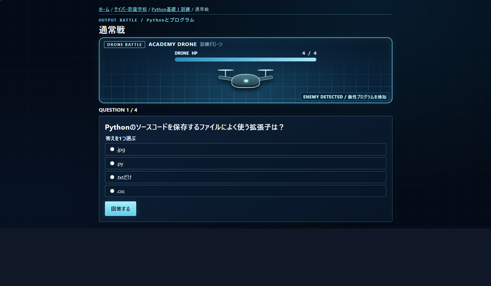
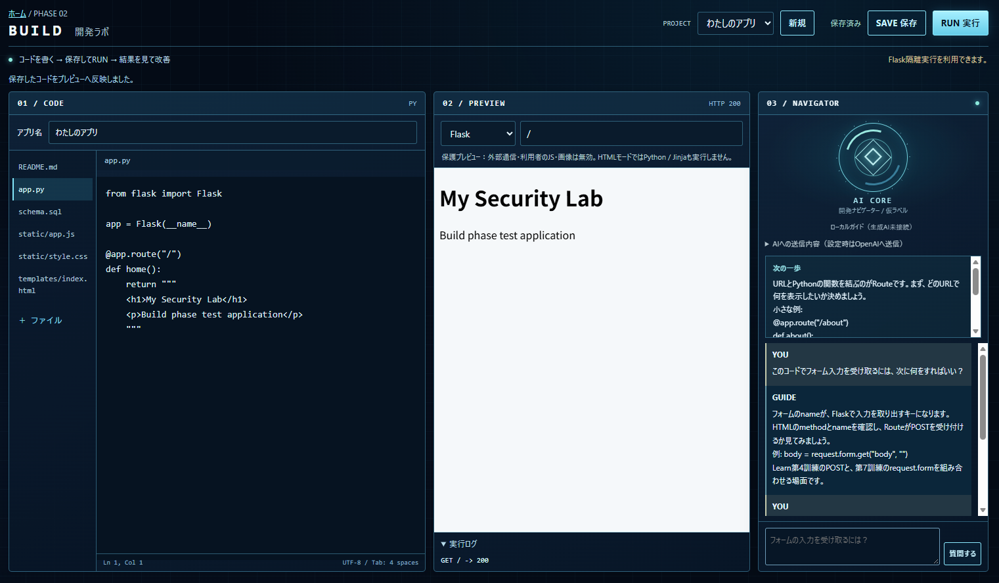
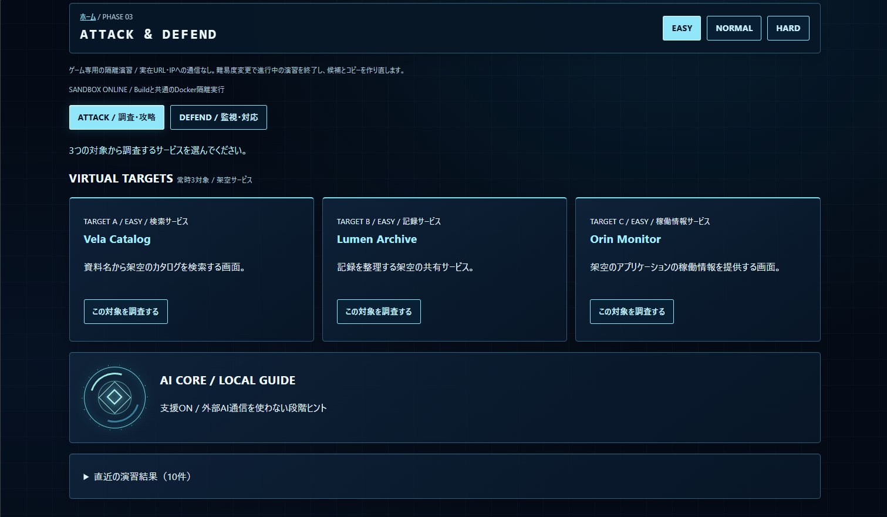

# Cyber Learning Game

IT・Python・Web開発・サイバーセキュリティを、
**Learn → Build → Attack & Defend** の3フェーズで段階的に学ぶ学習ゲームです。

単に知識を暗記するのではなく、

1. 基礎を学ぶ
2. 自分でWebアプリを作る
3. 攻撃と防御の両方を実践する

という流れで、知識を実際の操作へつなげることを目的としています。

---

## Screenshots

### Learn

教材と戦闘形式の問題演習で、IT・Python・Web・セキュリティを段階的に学びます。



### Build

コード編集、ライブプレビュー、AI COREを同一画面で利用しながらWebアプリを開発します。



### Attack & Defend

3つの仮想ターゲットから対象を選び、安全な隔離環境で攻撃・防御演習を行います。



---

## Concept

### 1. Learn

IT・Python・Web・データベース・セキュリティ・監視などを、教材と戦闘形式の問題演習で学びます。

正式カリキュラムとして第1〜12訓練を実装しています。

主な学習分野：

- コンピュータ・OS
- Python
- ネットワーク
- Web・HTTP
- HTML / CSS / JavaScript
- Flask
- データベース / SQL
- Git / 開発
- セキュリティ
- Webセキュリティ
- 監視・インシデント対応

各訓練では教材を読んだ後、通常戦とBOSS戦に挑戦します。

---

### 2. Build

Learnで学んだ知識を使い、実際に小規模なWebアプリを作る開発フェーズです。

主な機能：

- 複数ファイルのコード編集
- SAVE / RUN
- 同一画面でのライブプレビュー
- Flaskアプリ実行
- GET / POST / Redirect
- SQLite
- Session
- 実行ログ
- Dockerによる隔離実行
- Local Guideによる開発支援
- 初回オンボーディング

初回利用時にはAI COREが「何を作りたいか」を確認し、

- アプリの目的
- 主要機能候補
- 関連するLearn
- 最初の実装ステップ

を整理します。

OpenAI APIは任意で、APIキー未設定でもLocal Guideで利用できます。

詳細は [docs/BUILD.md](docs/BUILD.md) を参照してください。

---

### 3. Attack & Defend

Buildで作ったWebアプリや、ゲーム内に用意された仮想Webアプリを使って、攻撃と防御を実践します。

#### Attack

- 常に3つの仮想ターゲットを表示
- 1つを選んで攻略
- 実際のHTTP操作や応答確認を行う
- 攻略後は新しい対象を補充
- Easy / Normal / Hard に対応

#### Defend

- Phase 2で作成したWebアプリの隔離コピーを利用
- 仮想攻撃を受ける
- ログや挙動を確認
- 防御対応を行う
- 成功・失敗を判定
- 失敗時は改善の考え方を表示

難易度は次の3段階です。

- **Easy**：Local Guideによる補助あり
- **Normal**：補助なし
- **Hard**：Attackは高難度、Defendは表示中に不定時攻撃

すべてゲーム内・ローカルの隔離環境で実行し、実在サイトや第三者システムは対象にしません。

詳細は [docs/ATTACK_DEFEND.md](docs/ATTACK_DEFEND.md) を参照してください。

---

## Security Policy

本作品はサイバーセキュリティ学習を目的としています。

攻撃・防御演習の対象は以下に限定します。

- ゲーム内部の仮想システム
- Phase 2で作成したWebアプリの隔離コピー
- 開発者自身のローカル演習環境

第三者のシステムやネットワークへの無許可アクセスを目的とした機能は実装しません。

Docker sandboxでは、以下の制約を設けています。

- 外部ネットワーク遮断
- 非root実行
- read-only root filesystem
- tmpfs
- CPU / メモリ / プロセス数制限
- 実行時間制限
- Docker socket非公開
- ホストフォルダ非共有

---

## Current Status

現在、3フェーズすべての初期版を実装済みです。

- **Phase 1 Learn：初期完成**
- **Phase 2 Build：初期完成**
- **Phase 3 Attack & Defend：基盤初期完成**

テスト状況：

- **通常回帰 + 実Docker = 330 tests passed**

今後はPhase 3のシナリオ数を増やし、内容を拡充していく予定です。

---

## Tech Stack

- Python
- Flask
- HTML
- CSS
- JavaScript
- SQLite
- Docker
- pytest
- Git / GitHub

---

## Getting Started

### 1. 依存関係をインストール

```powershell
python -m pip install --user -r requirements.txt

2. Dockerを使う場合

BuildおよびAttack & DefendのFlask実行にはDocker環境を使用します。

docker build -t cyber-build-runtime:1 ./build_runtime
$env:BUILD_DOCKER_ENABLED = "1"
3. アプリ起動
python -m src.app

ブラウザーで次を開きます。

http://127.0.0.1:5000/

停止するときはターミナルで Ctrl+C を押します。

Tests

通常テスト：

python -m pytest

Docker実機テストを含む詳細な確認方法は各ドキュメントを参照してください。

Documentation
Project Brief
Learn Curriculum
MVP v0.1
Build
Attack & Defend
AGENTS.md
Development Style

本プロジェクトは、バイブコーディングを活用しながら段階的に開発しています。

最初から完成形を固定せず、

小さく作る
動かす
遊ぶ
テストする
改善する

というサイクルを繰り返しています。

Learn、Build、Attack & Defendを独立した機能にせず、学習内容が次のフェーズへつながる設計を重視しています。